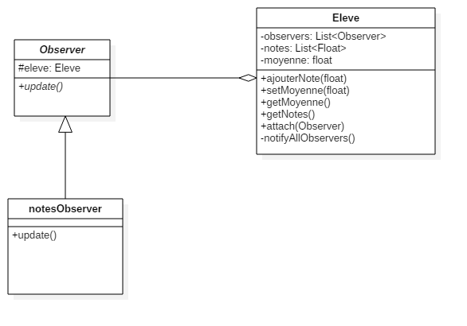

# Diagramme UML



# Code Java

## Eleve

```java
import java.util.List;
import java.util.ArrayList;

public class Eleve {
	
	private List<Observer> observers;
	private List<Float> notes;
	private float moyenne;
	
	public Eleve() {
		observers = new ArrayList<Observer>();
		notes = new ArrayList<Float>();
	}
	
	public void ajouterNote(float note) {
		notes.add(note);
		notifyAllObservers();
	}
	
	public void setMoyenne(float moyenne) {
		this.moyenne = moyenne;
	}
	
	public float getMoyenne() {
		return moyenne;
	}
	
	public List<Float> getNotes() {
		return notes;
	}
	
	public void attach(Observer observer){
		observers.add(observer);
	}
	
	private void notifyAllObservers() {
		for (Observer observer : observers) {
			observer.update();
		}
	}
}
```

## Observer

```java
public abstract class Observer {
   protected Eleve eleve;
   public abstract void update();
}
```

## notesObserver

```java
public class notesObserver extends Observer{

	public notesObserver(Eleve eleve){
		this.eleve = eleve;
		this.eleve.attach(this);
	}

	@Override
	public void update() {
		
		float moyenne = 0;
		
		for(float note : eleve.getNotes()) {
			moyenne += note;
		}
		
		moyenne /= eleve.getNotes().size();
		
		eleve.setMoyenne(moyenne);
	}

}
```

# Test

```java runnable

// { autofold
import java.util.List;
import java.util.ArrayList;

class Eleve {
	
	private List<Observer> observers;
	private List<Float> notes;
	private float moyenne;
	
	public Eleve() {
		observers = new ArrayList<Observer>();
		notes = new ArrayList<Float>();
	}
	
	public void ajouterNote(float note) {
		notes.add(note);
		notifyAllObservers();
	}
	
	public void setMoyenne(float moyenne) {
		this.moyenne = moyenne;
	}
	
	public float getMoyenne() {
		return moyenne;
	}
	
	public List<Float> getNotes() {
		return notes;
	}
	
	public void attach(Observer observer){
		observers.add(observer);
	}
	
	private void notifyAllObservers() {
		for (Observer observer : observers) {
			observer.update();
		}
	}
}

abstract class Observer {
   protected Eleve eleve;
   public abstract void update();
}

class notesObserver extends Observer{

	public notesObserver(Eleve eleve){
		this.eleve = eleve;
		this.eleve.attach(this);
	}

	@Override
	public void update() {
		
		float moyenne = 0;
		
		for(float note : eleve.getNotes()) {
			moyenne += note;
		}
		
		moyenne /= eleve.getNotes().size();
		
		eleve.setMoyenne(moyenne);
	}

}

// }

public class Main {
	
	public static void main(String[] args) {
		
		Eleve eleve = new Eleve();
		
		new notesObserver(eleve);
		
		eleve.ajouterNote(15.0f);
		System.out.println(eleve.getMoyenne());
		eleve.ajouterNote(5.0f);
		System.out.println(eleve.getMoyenne());
		eleve.ajouterNote(13.0f);
		System.out.println(eleve.getMoyenne());
		
	}
	
}


```
